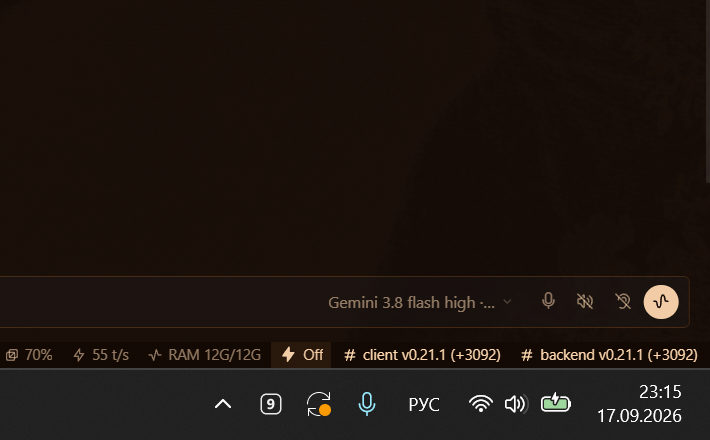

# 9Router Antigravity Tray Monitor 🚀

> **Легковесный монитор суммарных квот пула аккаунтов Google Antigravity (Gemini / Claude) для 9Router в системном трее Windows 11.**


---

## 📸 Скриншот

<p align="center">
  
</p>

---

## ✨ Возможности

- 📊 **Суммирование пула аккаунтов**: если у вас подключено 12 аккаунтов, монитор отображает реальный суммарный процент пула (например, `Gemini: 651%`, `Claude: 841%`).
- ⏱️ **Умный таймер сброса**: точно вычисляет ближайшее время сброса лимитов в минутах для моделей, квота которых исчерпана или расходуется.
- 🎨 **Нативный стиль Windows 11 Dark Mode**:
  - Чёрно-белая иконка в трее у системных часов.
  - Нативное тёмное контекстное меню Win32 (`uxtheme` ForceDark).
  - Поддержка Per-Monitor V2 DPI (идеальная чёткость шрифтов на 2K / 4K дисплеях без мыла).
- ⚡ **Параллельный опрос (ThreadPoolExecutor)**: опрос десятков аккаунтов занимает ~1–2 секунды без зависания интерфейса.
- 🔒 **Безопасность и автономность**:
  - Не требует ввода паролей или API-ключей.
  - Читает авторизацию и локальный пул напрямую из локального сервиса 9Router (`localhost:20128`).
- 🛡️ **Защита от дубликатов**: встроен Win32 Named Mutex — запуск второй копии процесса физически невозможен.
- 🪶 **Экстремально лёгкий**: потребляет всего ~15 МБ оперативной памяти (без Electron, Chromium или WebView).

---

## 🛠️ Установка и запуск

### Вариант 1: Быстрая установка (1 клик)
1. Склонируйте репозиторий или скачайте архив:
   ```bash
   git clone https://github.com/arturg-sudo/9router-antigravity-tray.git
   cd 9router-antigravity-tray
   ```
2. Запустите файл `install.bat` двойным кликом:
   - Он автоматически установит нужные библиотеки (`pystray`, `pillow`).
   - Добавит бесшумный запуск в автозагрузку Windows.
   - Запустит монитор в трее.

### Вариант 2: Вручную
1. Установите зависимости:
   ```bash
   pip install -r requirements.txt
   ```
2. Запустите в фоне без окна консоли:
   ```bash
   wscript.exe run.vbs
   ```

---

## ⚙️ Управление через меню (ПКМ)

По правому клику на значок **`9`** в системном трее доступно:
- **Статус квот**: сводные проценты и таймеры сброса для Gemini и Claude.
- **Аккаунты**: подменю со списком всех подключенных почт и их персональными процентами.
- **Стиль значка**:
  - `Логотип 9`: лаконичный монохромный квадрат с логотипом.
  - `Только процент %`: текущий суммарный процент пула.
  - `Логотип + %`: компактная плашка с логотипом и процентом.
- **🔄 Обновить сейчас**: принудительное внеочередное обновление.
- **❌ Выход**: завершение работы монитора.

---

## 📄 Лицензия

Проект распространяется под открытой лицензией [MIT](LICENSE).
